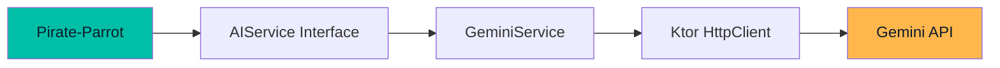
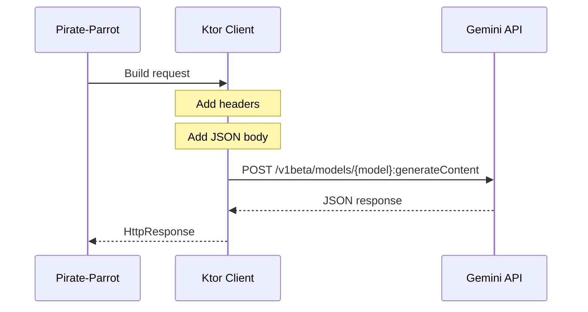
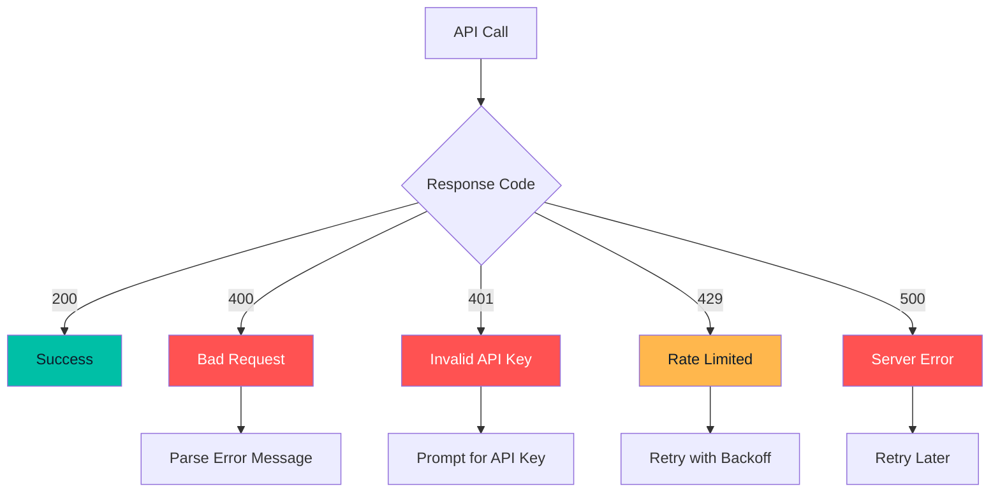

# AI Integration

Deep dive into the Google Gemini API integration.

## Overview

Pirate-Parrot uses Google's Gemini AI for image analysis and content generation. The integration is handled by the `AIService` interface and `GeminiService` implementation.



## AIService Interface

```kotlin
interface AIService {
    suspend fun generateSolution(
        problemDescription: String,
        language: String
    ): Result<SolutionResponse>
    
    suspend fun analyzeCodingChallenge(
        imageBase64: String,
        language: String
    ): Result<SolutionResponse>
    
    suspend fun analyzeCertificationQuestion(
        imageBase64: String,
        certificationType: CertificationType
    ): Result<CertificationResponse>
    
    suspend fun analyzeGenericExam(
        imageBase64: String,
        examType: GenericExamType,
        additionalContext: String?
    ): Result<GenericExamResponse>
}
```

## Response Models

### SolutionResponse

```kotlin
@Serializable
data class SolutionResponse(
    val code: String,
    val explanation: String,
    val timeComplexity: String,
    val spaceComplexity: String
)
```

### CertificationResponse

```kotlin
@Serializable
data class CertificationResponse(
    val answers: List<CertificationQuestionAnswer>,
    val examTips: String
)

@Serializable
data class CertificationQuestionAnswer(
    val questionNumber: Int,
    val questionSummary: String,
    val correctAnswer: String,
    val explanation: String,
    val incorrectAnswersExplanation: String,
    val relatedServices: List<String>
)
```

### GenericExamResponse

```kotlin
@Serializable
data class GenericExamResponse(
    val answers: List<GenericExamQuestionAnswer>,
    val studyTips: String,
    val detectedLanguage: String
)
```

## API Communication

### Request Structure



### Request Body Format

```json
{
  "contents": [
    {
      "parts": [
        {
          "text": "Analyze this coding challenge..."
        },
        {
          "inlineData": {
            "mimeType": "image/png",
            "data": "base64_encoded_image_data"
          }
        }
      ]
    }
  ]
}
```

### Response Format

```json
{
  "candidates": [
    {
      "content": {
        "parts": [
          {
            "text": "{\"code\": \"...\", \"explanation\": \"...\"}"
          }
        ]
      }
    }
  ]
}
```

## Prompt Engineering

### Code Challenge Prompt

```kotlin
private fun buildImageAnalysisPrompt(language: String): String = """
    Analyze this coding challenge screenshot and provide 
    a complete solution in $language.
    
    Extract the problem description from the image and solve it.
    
    Provide your response in JSON format:
    {
      "code": "complete solution code",
      "explanation": "brief explanation of the approach",
      "timeComplexity": "O(...)",
      "spaceComplexity": "O(...)"
    }
    
    Important: Return ONLY the JSON, no markdown code blocks.
""".trimIndent()
```

### Certification Prompt

```kotlin
private fun buildCertificationPrompt(type: CertificationType): String = """
    You are an expert AWS certification instructor helping 
    prepare for the ${type.displayName} exam.
    
    CRITICAL INSTRUCTIONS:
    1. DETECT the language and RESPOND IN THE SAME LANGUAGE
    2. Answer ALL questions visible in the screenshot
    3. For EACH question:
       - Identify the correct answer(s)
       - Explain why correct
       - Explain why others are wrong
       - List related AWS services
    
    Provide response in JSON format:
    {
      "answers": [...],
      "examTips": "..."
    }
""".trimIndent()
```

## Model Selection

### Available Models

| Model | Best For | Speed | Cost |
|-------|----------|-------|------|
| `gemini-2.5-flash` | Most tasks | ⚡ Fast | 💰 Low |
| `gemini-2.5-pro` | Complex problems | 🐢 Slower | 💰💰 Higher |

### Model Configuration

```kotlin
class GeminiService(
    private val apiKeyProvider: suspend () -> String,
    private val httpClient: HttpClient,
    private val settingsRepository: SettingsRepository,
    private val defaultModel: String = "gemini-2.5-flash"
) : AIService {
    
    private suspend fun getModel(): String {
        return settingsRepository.getSetting(SettingsKeys.SELECTED_MODEL) 
            ?: defaultModel
    }
}
```

## Error Handling

### Error Types



### Error Handling Code

```kotlin
private suspend fun makeGeminiRequest(
    model: String,
    apiKey: String,
    block: HttpRequestBuilder.() -> Unit
): HttpResponse {
    val response = httpClient.post("$baseUrl/models/$model:generateContent") {
        header("x-goog-api-key", apiKey)
        contentType(ContentType.Application.Json)
        block()
    }
    
    if (response.status.value !in 200..299) {
        val errorBody = response.body<String>()
        throw Exception("Gemini API error (${response.status.value}): $errorBody")
    }
    
    return response
}
```

## JSON Parsing

### Response Extraction

```kotlin
private suspend fun extractResponseContent(response: HttpResponse): String {
    val geminiResponse = response.body<GeminiResponse>()
    
    if (geminiResponse.candidates.isEmpty()) {
        throw Exception("Gemini returned no candidates")
    }
    
    return geminiResponse.candidates.first().content.parts.first().text
}
```

### JSON Cleanup

The AI sometimes returns JSON wrapped in markdown code blocks. `JsonUtils` handles this:

```kotlin
object JsonUtils {
    fun <T> parseJsonResponse(content: String): T {
        // Remove markdown code blocks if present
        val cleanJson = content
            .removePrefix("```json")
            .removePrefix("```")
            .removeSuffix("```")
            .trim()
        
        return json.decodeFromString(cleanJson)
    }
}
```

## Security

### API Key Storage

- Stored in local SQLite database
- Never logged or transmitted except to Gemini API
- Header-based authentication (not query parameter)

```kotlin
private suspend fun makeGeminiRequest(...) {
    httpClient.post(url) {
        header("x-goog-api-key", apiKey)  // Secure header
        // NOT: url.parameters.append("key", apiKey)
    }
}
```

### Rate Limiting

The free tier has generous limits, but the app handles rate limiting:

```kotlin
install(HttpTimeout) {
    requestTimeoutMillis = 60000  // 60 second timeout
}
```

## Testing

### Mock Service

For testing, create a mock implementation:

```kotlin
class MockAIService : AIService {
    override suspend fun analyzeCodingChallenge(
        imageBase64: String,
        language: String
    ): Result<SolutionResponse> {
        return Result.success(
            SolutionResponse(
                code = "fun solution() = 42",
                explanation = "Mock explanation",
                timeComplexity = "O(1)",
                spaceComplexity = "O(1)"
            )
        )
    }
}
```

## Performance Optimization

### Image Compression

Before sending to API:
1. Resize large images
2. Compress to reduce payload size
3. Use PNG for screenshots (lossless)

### Caching

Consider caching responses for identical images (future enhancement).

## API Limits

### Free Tier Limits

| Limit | Value |
|-------|-------|
| Requests per minute | 60 |
| Requests per day | 1,500 |
| Tokens per minute | 1,000,000 |

### Best Practices

1. **Don't spam requests** - Wait for response before new request
2. **Optimize images** - Smaller images = faster processing
3. **Handle errors gracefully** - Show user-friendly messages
4. **Cache when possible** - Avoid duplicate requests
