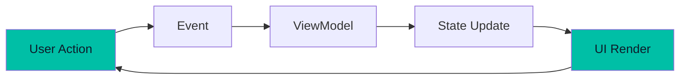
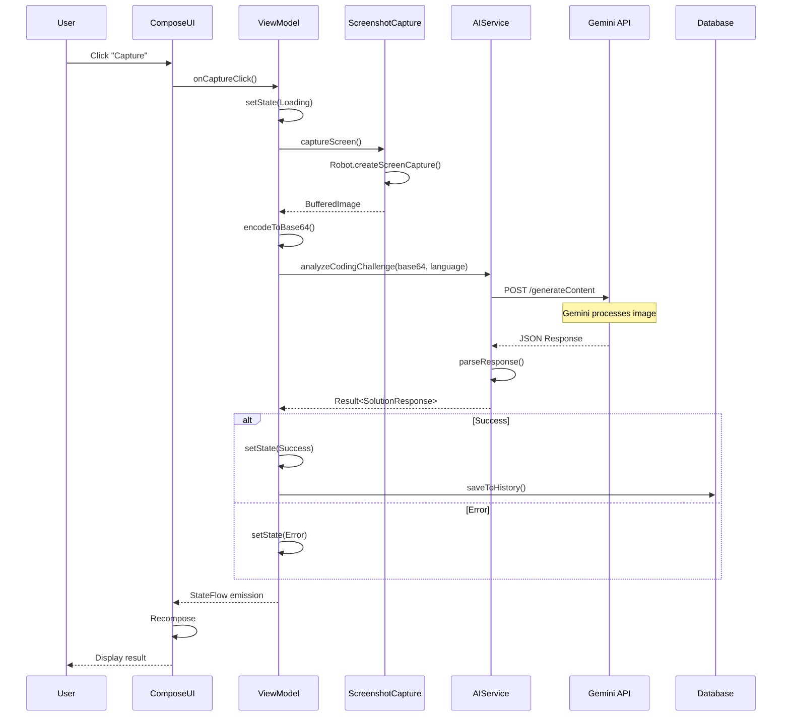
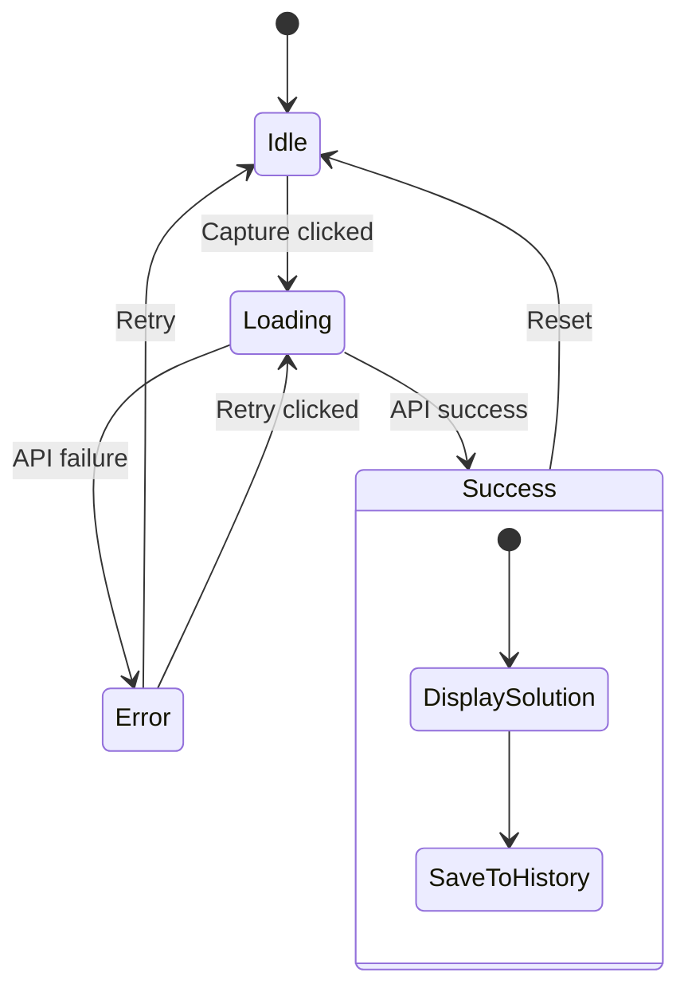
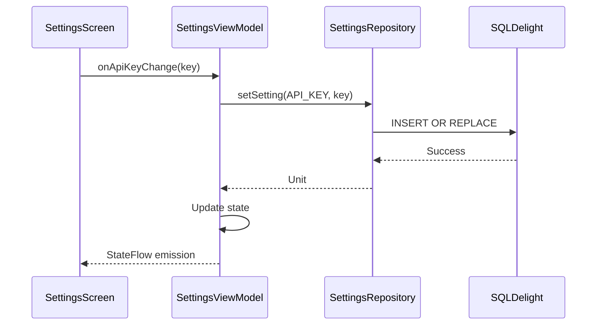
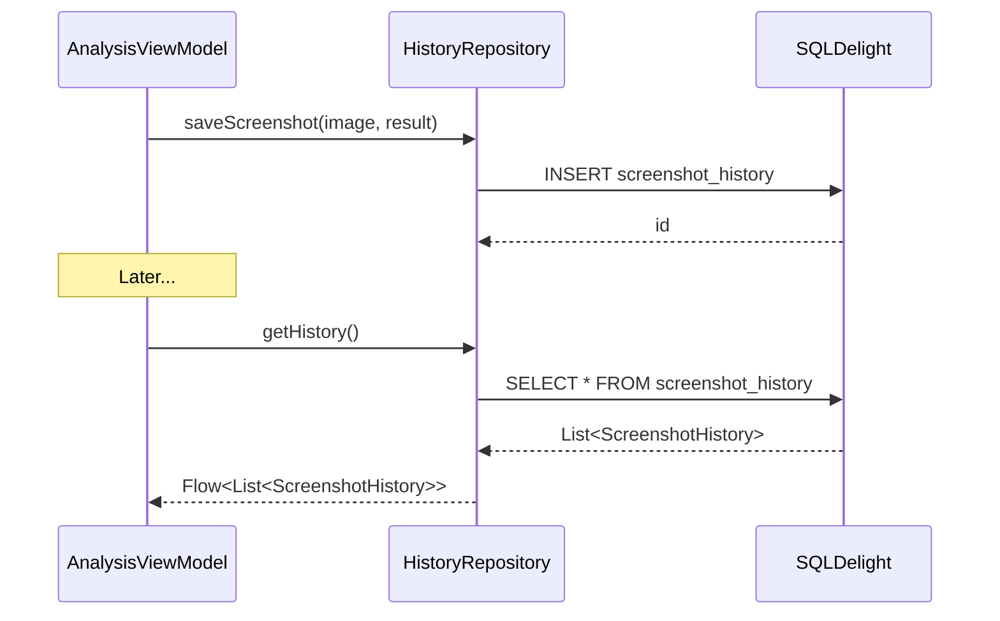
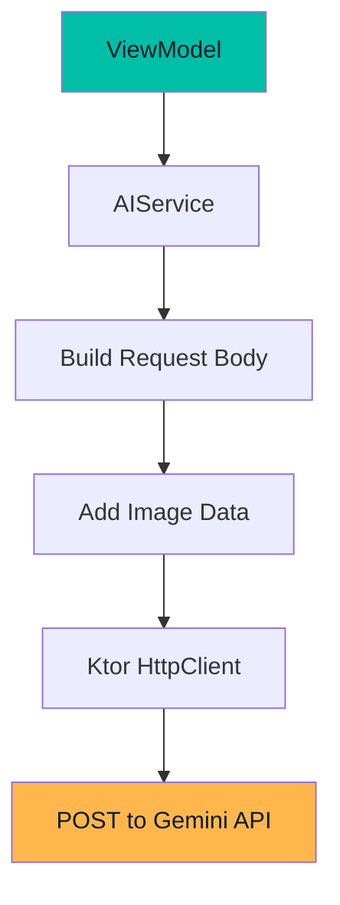
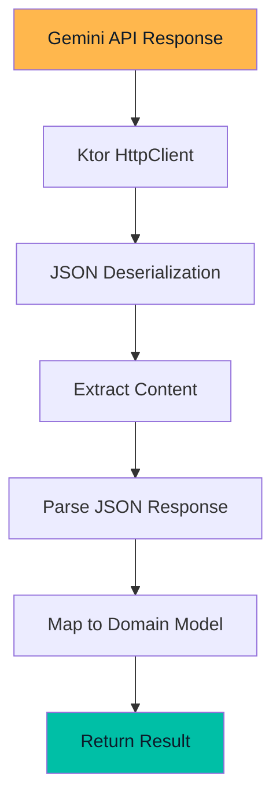
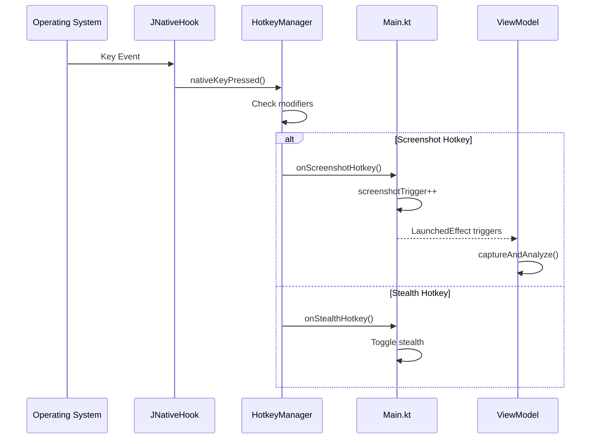
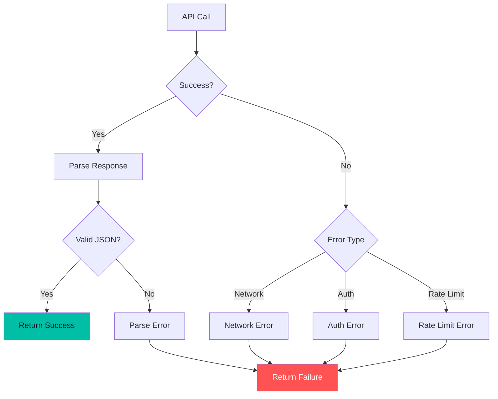
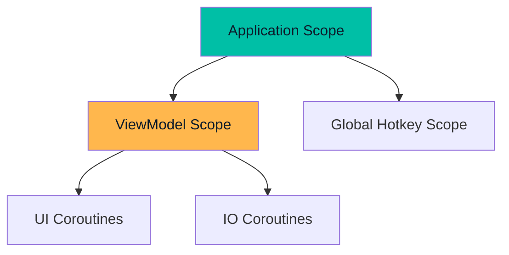

# Data Flow

How data moves through Pirate-Parrot from user action to displayed result.

## Overview

Pirate-Parrot uses a **unidirectional data flow** pattern where:
1. User actions trigger events
2. Events are processed by ViewModels
3. ViewModels update state
4. UI observes and renders state



## Screenshot Analysis Flow

### Complete Flow Diagram



## State Management

### ViewModel State

Each ViewModel manages its own state using `StateFlow`:

```kotlin
class ScreenshotAnalysisViewModel : ViewModel() {
    private val _uiState = MutableStateFlow(UiState())
    val uiState: StateFlow<UiState> = _uiState.asStateFlow()
    
    data class UiState(
        val isLoading: Boolean = false,
        val screenshot: ImageBitmap? = null,
        val solution: SolutionResponse? = null,
        val error: String? = null
    )
}
```

### State Transitions



## Data Persistence Flow

### Settings Flow



### History Flow



## API Communication Flow

### Request Flow



### Response Flow



## Event Handling

### Hotkey Events



## Error Handling Flow



## Coroutine Scopes

### Scope Hierarchy



### Dispatcher Usage

| Operation | Dispatcher | Reason |
|-----------|------------|--------|
| UI Updates | `Main` | Compose requires main thread |
| API Calls | `IO` | Network operations |
| Image Processing | `Default` | CPU-intensive |
| Database | `IO` | Disk operations |

## Reactive Streams

### Flow Usage

```kotlin
// Settings as Flow
val apiKey: Flow<String?> = settingsRepository
    .getSettingFlow(SettingsKeys.API_KEY)

// History as Flow
val history: Flow<List<ScreenshotHistory>> = historyRepository
    .getAllHistory()

// UI observes
val apiKey by viewModel.apiKey.collectAsState()
```

### StateFlow vs SharedFlow

| Type | Use Case |
|------|----------|
| `StateFlow` | UI state (always has value) |
| `SharedFlow` | One-time events (navigation, snackbar) |
