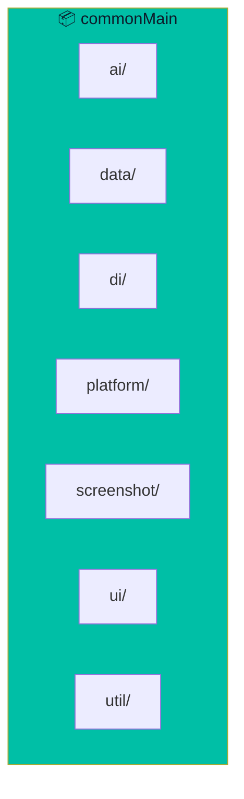

# Project Structure

Detailed breakdown of the Pirate-Parrot codebase organization.

## Root Directory

```
pirate-parrot-ai/
├── composeApp/          # Main application module
├── native/              # Native platform code
├── gradle/              # Gradle configuration
├── docs/                # Documentation (you are here!)
├── build.gradle.kts     # Root build script
├── settings.gradle.kts  # Project settings
├── gradle.properties    # Gradle properties
├── README.md            # Project readme
└── BUILD.md             # Build instructions
```

## Application Module

```
composeApp/
├── src/
│   ├── commonMain/      # Shared code (all platforms)
│   ├── jvmMain/         # JVM-specific code
│   └── jvmTest/         # JVM tests
└── build.gradle.kts     # Module build script
```

## Common Main (Shared Code)



### Detailed Structure

```
commonMain/kotlin/com/github/ericomonteiro/copilot/
├── ai/
│   └── AIService.kt           # AI service interface & Gemini implementation
├── data/
│   ├── model/                 # Data models
│   └── repository/            # Data repositories
│       └── SettingsRepository.kt
├── di/
│   └── AppModule.kt           # Koin dependency injection module
├── platform/
│   └── Platform.kt            # Platform abstractions
├── screenshot/
│   └── ScreenshotCaptureConfig.kt
├── ui/
│   ├── App.kt                 # Main app composable
│   ├── certification/         # Certification mode
│   │   ├── CertificationAnalysisScreen.kt
│   │   └── CertificationAnalysisViewModel.kt
│   ├── components/            # Reusable UI components
│   ├── exam/                  # Generic exam mode
│   │   ├── GenericExamScreen.kt
│   │   └── GenericExamViewModel.kt
│   ├── history/               # Screenshot history
│   │   ├── ScreenshotHistoryScreen.kt
│   │   └── ScreenshotHistoryViewModel.kt
│   ├── home/                  # Home screen
│   │   └── HomeScreen.kt
│   ├── screenshot/            # Code challenge mode
│   │   ├── ScreenshotAnalysisScreen.kt
│   │   └── ScreenshotAnalysisViewModel.kt
│   ├── settings/              # Settings screen
│   │   ├── SettingsScreen.kt
│   │   └── SettingsViewModel.kt
│   └── theme/                 # App theming
│       └── AppTheme.kt
└── util/
    ├── AppLogger.kt           # Logging utility
    ├── JsonUtils.kt           # JSON parsing utilities
    └── SettingsKeys.kt        # Settings key constants
```

## JVM Main (Platform-Specific)

```
jvmMain/kotlin/com/github/ericomonteiro/copilot/
├── main.kt                    # Application entry point
├── hotkey/
│   └── GlobalHotkeyManager.kt # Global keyboard shortcuts
├── platform/
│   └── WindowManager.kt       # Native window management
└── screenshot/
    └── ScreenshotCapture.kt   # Screen capture implementation
```

## Native Code

```
native/
└── macos/
    ├── build.sh               # Build script
    ├── build_jni.sh           # JNI build script
    ├── stealth_jni.m          # Stealth mode JNI
    └── stealth.m              # Stealth mode implementation
```

## Key Files Explained

### `main.kt`

Application entry point:

```kotlin
fun main() {
    application {
        // Initialize Koin
        // Setup window
        // Register hotkeys
        // Launch Compose UI
    }
}
```

### `App.kt`

Main composable with navigation:

```kotlin
@Composable
fun App() {
    var currentScreen by remember { mutableStateOf(Screen.HOME) }
    
    when (currentScreen) {
        Screen.HOME -> HomeScreen(...)
        Screen.SCREENSHOT_ANALYSIS -> ScreenshotAnalysisScreen(...)
        Screen.CERTIFICATION_ANALYSIS -> CertificationAnalysisScreen(...)
        // ...
    }
}
```

### `AIService.kt`

AI integration interface:

```kotlin
interface AIService {
    suspend fun analyzeCodingChallenge(
        imageBase64: String,
        language: String
    ): Result<SolutionResponse>
    
    suspend fun analyzeCertificationQuestion(
        imageBase64: String,
        certificationType: CertificationType
    ): Result<CertificationResponse>
}
```

### `AppModule.kt`

Koin dependency injection:

```kotlin
val appModule = module {
    single { HttpClientFactory.create() }
    single { SettingsRepository(get()) }
    single<AIService> { GeminiService(get(), get()) }
    viewModel { ScreenshotAnalysisViewModel(get(), get()) }
    // ...
}
```

## Gradle Configuration

### Version Catalog

```
gradle/libs.versions.toml
```

Defines all dependency versions in one place:

```toml
[versions]
kotlin = "2.2.20"
composeMultiplatform = "1.9.1"
ktor = "2.3.7"

[libraries]
ktor-clientCore = { module = "io.ktor:ktor-client-core", version.ref = "ktor" }

[plugins]
kotlinMultiplatform = { id = "org.jetbrains.kotlin.multiplatform", version.ref = "kotlin" }
```

### Build Script

```
composeApp/build.gradle.kts
```

Configures:
- Kotlin Multiplatform
- Compose Desktop
- Dependencies
- Native distributions

## Database Schema

SQLDelight generates type-safe code from SQL:

```
composeApp/src/commonMain/sqldelight/
└── com/github/ericomonteiro/copilot/db/
    └── Database.sq
```

## Resource Files

```
composeApp/src/commonMain/composeResources/
├── drawable/              # Images
├── font/                  # Custom fonts
└── values/                # Strings, colors
```

## Test Structure

```
composeApp/src/jvmTest/kotlin/
└── com/github/ericomonteiro/copilot/
    ├── ai/
    │   └── AIServiceTest.kt
    └── util/
        └── JsonUtilsTest.kt
```
