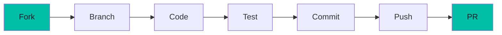

# Contributing

Thank you for your interest in contributing to Pirate-Parrot! 🦜

## Getting Started

### Prerequisites

- **JDK 21** or later
- **Git**
- **IDE** (IntelliJ IDEA recommended)

### Setup

```bash
# Fork and clone
git clone https://github.com/YOUR_USERNAME/pirate-parrot-ai.git
cd pirate-parrot-ai

# Run the app
./gradlew :composeApp:run
```

## Development Workflow



### 1. Fork the Repository

Click the "Fork" button on GitHub to create your own copy.

### 2. Create a Branch

```bash
git checkout -b feature/your-feature-name
```

Branch naming conventions:
- `feature/` - New features
- `fix/` - Bug fixes
- `docs/` - Documentation
- `refactor/` - Code refactoring

### 3. Make Changes

Follow the [code style guidelines](#code-style) below.

### 4. Test Your Changes

```bash
# Run tests
./gradlew :composeApp:test

# Run the app and verify
./gradlew :composeApp:run
```

### 5. Commit

Write clear, descriptive commit messages:

```bash
git commit -m "feat: add support for new certification type"
```

Commit message format:
- `feat:` - New feature
- `fix:` - Bug fix
- `docs:` - Documentation
- `refactor:` - Code refactoring
- `test:` - Tests
- `chore:` - Maintenance

### 6. Push and Create PR

```bash
git push origin feature/your-feature-name
```

Then create a Pull Request on GitHub.

---

## Code Style

### Kotlin Style

Follow the [Kotlin Coding Conventions](https://kotlinlang.org/docs/coding-conventions.html):

```kotlin
// ✅ Good
class MyViewModel(
    private val repository: Repository
) : ViewModel() {
    
    private val _uiState = MutableStateFlow(UiState())
    val uiState: StateFlow<UiState> = _uiState.asStateFlow()
    
    fun doSomething() {
        viewModelScope.launch {
            // ...
        }
    }
}

// ❌ Bad
class myviewmodel(private val repository: Repository): ViewModel() {
    private val _uiState = MutableStateFlow(UiState())
    val uiState: StateFlow<UiState> = _uiState.asStateFlow()
    fun doSomething() { viewModelScope.launch { /* ... */ } }
}
```

### Compose Style

```kotlin
// ✅ Good
@Composable
fun MyScreen(
    viewModel: MyViewModel = koinViewModel(),
    onNavigate: () -> Unit
) {
    val uiState by viewModel.uiState.collectAsState()
    
    Column(
        modifier = Modifier
            .fillMaxSize()
            .padding(16.dp)
    ) {
        // Content
    }
}

// ❌ Bad
@Composable
fun MyScreen(viewModel: MyViewModel = koinViewModel(), onNavigate: () -> Unit) {
    val uiState by viewModel.uiState.collectAsState()
    Column(modifier = Modifier.fillMaxSize().padding(16.dp)) { /* Content */ }
}
```

### Naming Conventions

| Type | Convention | Example |
|------|------------|---------|
| Classes | PascalCase | `ScreenshotAnalysisViewModel` |
| Functions | camelCase | `captureScreenshot()` |
| Properties | camelCase | `isLoading` |
| Constants | SCREAMING_SNAKE | `API_KEY` |
| Packages | lowercase | `com.github.ericomonteiro.pirateparrotai` |

---

## Project Structure

When adding new features, follow the existing structure:

```
composeApp/src/commonMain/kotlin/.../
├── ai/           # AI service related
├── data/         # Data layer (repositories, models)
├── di/           # Dependency injection
├── ui/           # UI components
│   ├── feature/  # Feature-specific screens
│   │   ├── FeatureScreen.kt
│   │   └── FeatureViewModel.kt
│   └── components/  # Reusable components
└── util/         # Utilities
```

---

## Adding New Features

### New Analysis Mode

1. Create data models in `ai/AIService.kt`
2. Add method to `AIService` interface
3. Implement in `GeminiService`
4. Create UI screen and ViewModel
5. Add to navigation in `App.kt`
6. Update documentation

### New Setting

1. Add key to `SettingsKeys`
2. Update `SettingsScreen` UI
3. Update `SettingsViewModel`
4. Document in `api/settings.md`

---

## Testing

### Unit Tests

```kotlin
class AIServiceTest {
    @Test
    fun `analyzeCodingChallenge returns valid response`() = runTest {
        val service = GeminiService(...)
        val result = service.analyzeCodingChallenge(testImage, "Kotlin")
        
        assertTrue(result.isSuccess)
        assertNotNull(result.getOrNull()?.code)
    }
}
```

### Manual Testing Checklist

- [ ] App launches without errors
- [ ] Screenshot capture works
- [ ] AI analysis returns results
- [ ] Stealth mode toggles correctly
- [ ] Hotkeys work system-wide
- [ ] Settings persist across restarts

---

## Documentation

When adding features, update:

1. **Code comments** - For complex logic
2. **README.md** - If user-facing
3. **docs/** - Detailed documentation
4. **CHANGELOG.md** - For releases

---

## Pull Request Guidelines

### PR Title

Use the same format as commit messages:

```
feat: add support for AWS DevOps certification
```

### PR Description

Include:
- **What** - What does this PR do?
- **Why** - Why is this change needed?
- **How** - How was it implemented?
- **Testing** - How was it tested?

### PR Checklist

- [ ] Code follows style guidelines
- [ ] Tests pass
- [ ] Documentation updated
- [ ] No breaking changes (or documented)
- [ ] Commits are clean and descriptive

---

## Getting Help

- **Issues** - For bugs and feature requests
- **Discussions** - For questions and ideas
- **Discord** - For real-time chat (if available)

---

## Code of Conduct

Be respectful and inclusive. We welcome contributors of all backgrounds and experience levels.

---

## License

By contributing, you agree that your contributions will be licensed under the MIT License.

---

<p align="center">
  Thank you for contributing! 🦜❤️
</p>
