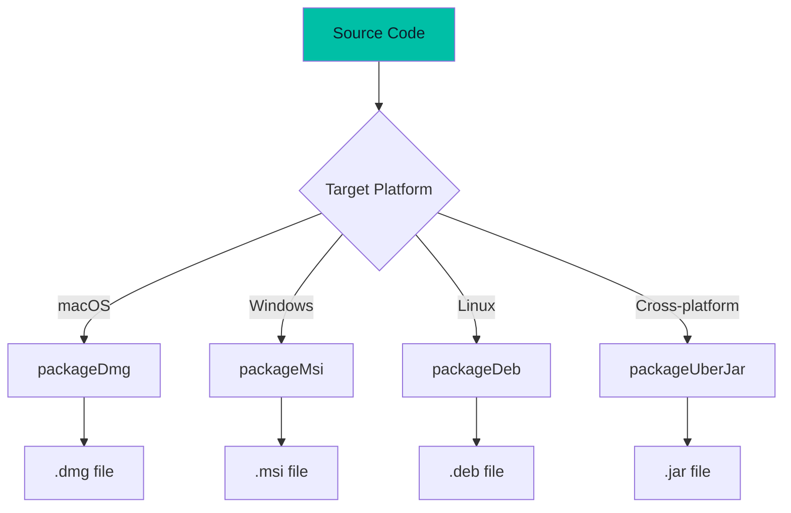
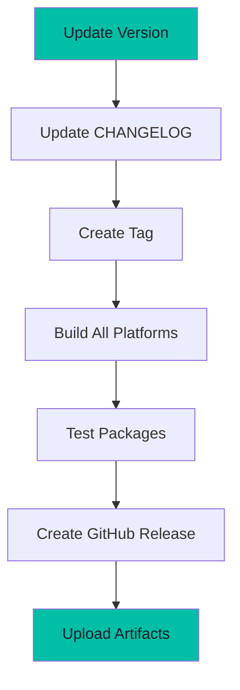

# Build Guide

Comprehensive guide for building Pirate-Parrot from source.

## Prerequisites

| Requirement | Version | Check Command |
|-------------|---------|---------------|
| JDK | 21+ | `java -version` |
| Gradle | 8.x (wrapper included) | `./gradlew --version` |
| Git | Any | `git --version` |

### Platform-Specific

| Platform | Additional Requirements |
|----------|------------------------|
| macOS | Xcode Command Line Tools |
| Windows | [WiX Toolset](https://wixtoolset.org/) for MSI |
| Linux | `libxkbcommon`, build-essential |

---

## Quick Start

```bash
# Clone
git clone https://github.com/ericomonteiro/pirate-parrot-ai.git
cd pirate-parrot-ai

# Run in development mode
./gradlew :composeApp:run
```

---

## Build Commands

### Development

```bash
# Run with hot reload
./gradlew :composeApp:run

# Run tests
./gradlew :composeApp:test

# Clean build
./gradlew clean :composeApp:run
```

### Production Builds



#### macOS (.dmg)

```bash
./gradlew :composeApp:packageDmg
```

Output: `composeApp/build/compose/binaries/main/dmg/pirate-parrot-1.0.0.dmg`

#### Windows (.msi)

```bash
# Must be run on Windows
gradlew.bat :composeApp:packageMsi
```

Output: `composeApp/build/compose/binaries/main/msi/pirate-parrot-1.0.0.msi`

> **Note:** Requires WiX Toolset installed and in PATH.

#### Linux (.deb)

```bash
# Must be run on Linux
./gradlew :composeApp:packageDeb
```

Output: `composeApp/build/compose/binaries/main/deb/pirate-parrot_1.0.0_amd64.deb`

#### Cross-Platform JAR

```bash
./gradlew :composeApp:packageUberJarForCurrentOS
```

Output: `composeApp/build/compose/jars/pirate-parrot-macos-arm64-1.0.0.jar`

Run with:
```bash
java -jar pirate-parrot-*.jar
```

---

## Build Configuration

### Gradle Properties

`gradle.properties`:

```properties
org.gradle.jvmargs=-Xmx2048m
org.gradle.parallel=true
kotlin.code.style=official
```

### Version Catalog

`gradle/libs.versions.toml`:

```toml
[versions]
kotlin = "2.2.20"
composeMultiplatform = "1.9.1"
ktor = "2.3.7"
sqldelight = "2.0.1"
koin = "3.5.3"

[libraries]
# ... library definitions

[plugins]
# ... plugin definitions
```

### Application Configuration

`composeApp/build.gradle.kts`:

```kotlin
compose.desktop {
    application {
        mainClass = "com.github.ericomonteiro.pirateparrotai.MainKt"

        nativeDistributions {
            targetFormats(TargetFormat.Dmg, TargetFormat.Msi, TargetFormat.Deb)
            packageName = "pirate-parrot"
            packageVersion = "1.0.0"
            
            modules("java.sql")
            
            windows {
                menuGroup = "Pirate-Parrot"
                perUserInstall = true
                shortcut = true
            }
        }
    }
}
```

---

## Build Targets

### All Available Tasks

```bash
# List all tasks
./gradlew tasks --all

# Common tasks
./gradlew :composeApp:run                    # Run app
./gradlew :composeApp:test                   # Run tests
./gradlew :composeApp:packageDmg             # macOS DMG
./gradlew :composeApp:packageMsi             # Windows MSI
./gradlew :composeApp:packageDeb             # Linux DEB
./gradlew :composeApp:packageUberJarForCurrentOS  # JAR
./gradlew :composeApp:packageDistributionForCurrentOS  # All formats
```

---

## Troubleshooting

### Common Issues

| Issue | Solution |
|-------|----------|
| `JAVA_HOME not set` | Set JAVA_HOME to JDK 21 path |
| `Gradle daemon error` | Run `./gradlew --stop` |
| `Out of memory` | Increase `-Xmx` in gradle.properties |
| `WiX not found` | Install WiX and add to PATH |

### Clean Build

```bash
# Full clean
./gradlew clean
rm -rf ~/.gradle/caches/

# Rebuild
./gradlew :composeApp:run
```

### Gradle Wrapper Update

```bash
./gradlew wrapper --gradle-version=8.5
```

---

## CI/CD

### GitHub Actions Example

```yaml
name: Build

on:
  push:
    branches: [main]
  pull_request:
    branches: [main]

jobs:
  build:
    strategy:
      matrix:
        os: [macos-latest, windows-latest, ubuntu-latest]
    
    runs-on: ${{ matrix.os }}
    
    steps:
      - uses: actions/checkout@v4
      
      - name: Set up JDK 21
        uses: actions/setup-java@v4
        with:
          java-version: '21'
          distribution: 'temurin'
      
      - name: Build
        run: ./gradlew :composeApp:test
      
      - name: Package
        run: ./gradlew :composeApp:packageDistributionForCurrentOS
      
      - name: Upload artifacts
        uses: actions/upload-artifact@v4
        with:
          name: package-${{ matrix.os }}
          path: composeApp/build/compose/binaries/
```

---

## Release Process



### Version Update

1. Update `packageVersion` in `build.gradle.kts`
2. Update version badges in `README.md`
3. Update `CHANGELOG.md`

### Create Release

```bash
# Tag
git tag -a v1.0.0 -m "Release 1.0.0"
git push origin v1.0.0

# Build all platforms
./gradlew :composeApp:packageDistributionForCurrentOS
```

---

## Development Tips

### Hot Reload

```bash
./gradlew :composeApp:run
```

Changes to Compose code will hot reload automatically.

### Debug Mode

```bash
./gradlew :composeApp:run --debug
```

### Profile Build

```bash
./gradlew :composeApp:run --scan
```

Generates a build scan with performance metrics.
