# Global Hotkeys

Control Pirate-Parrot from anywhere with keyboard shortcuts.

## Overview

Global hotkeys work **system-wide**, meaning you can trigger actions even when Pirate-Parrot is not the focused window. This enables a seamless workflow where you can capture screenshots without switching applications.


## Available Hotkeys

### Screenshot Capture

Captures the screen and triggers analysis in the current mode.

| Platform | Hotkey |
|----------|--------|
| macOS | <kbd>Cmd</kbd> + <kbd>Shift</kbd> + <kbd>Opt</kbd> + <kbd>S</kbd> |
| Windows | <kbd>Ctrl</kbd> + <kbd>Shift</kbd> + <kbd>Alt</kbd> + <kbd>S</kbd> |

**Behavior:**
- If on Home/Settings/History → Switches to Code Challenge mode
- If on Code Challenge → Captures for code analysis
- If on Certification → Captures for certification analysis
- If on Generic Exam → Captures for exam analysis

### Toggle Stealth Mode

Shows/hides the app from screen capture.

| Platform | Hotkey |
|----------|--------|
| macOS | <kbd>Cmd</kbd> + <kbd>Shift</kbd> + <kbd>Opt</kbd> + <kbd>B</kbd> |
| Windows | <kbd>Ctrl</kbd> + <kbd>Shift</kbd> + <kbd>Alt</kbd> + <kbd>B</kbd> |

**Behavior:**
- Toggles stealth mode on/off
- Saves preference to database
- Shows status in UI

## Technical Implementation

### JNativeHook Library

Pirate-Parrot uses [JNativeHook](https://github.com/kwhat/jnativehook) for cross-platform global hotkey support.

```kotlin
class GlobalHotkeyManager(
    private val onScreenshotHotkey: () -> Unit,
    private val onStealthHotkey: () -> Unit
) {
    fun register() {
        GlobalScreen.registerNativeHook()
        GlobalScreen.addNativeKeyListener(this)
    }
    
    fun unregister() {
        GlobalScreen.removeNativeKeyListener(this)
        GlobalScreen.unregisterNativeHook()
    }
}
```

### Key Detection


### Modifier Key Mapping

| Key | macOS | Windows |
|-----|-------|---------|
| Primary | `Cmd` (⌘) | `Ctrl` |
| Secondary | `Shift` (⇧) | `Shift` |
| Tertiary | `Opt` (⌥) | `Alt` |

## Platform Requirements

### macOS

**Accessibility Permission Required**

The app needs Accessibility permission to receive global key events.

1. Open **System Preferences**
2. Go to **Security & Privacy** → **Privacy**
3. Select **Accessibility**
4. Add Pirate-Parrot to the list
5. Restart the app

```mermaid
flowchart TD
    A[Launch App] --> B{Accessibility Permission?}
    B -->|No| C[System Preferences]
    C --> D[Security & Privacy]
    D --> E[Privacy → Accessibility]
    E --> F[Add Pirate-Parrot]
    F --> G[Restart App]
    G --> B
    B -->|Yes| H[✅ Hotkeys Work]
    
    style H fill:#00BFA6,color:#0D1B2A
```



### Windows

- **Run as Administrator** if hotkeys don't register
- Some antivirus software may block global hooks
- Add exception if needed

### Linux

- Requires `libxkbcommon`
- May need to run with elevated privileges
- X11 required (Wayland has limitations)

## Workflow Examples

### Code Interview Workflow


### Screen Share Workflow

```mermaid
sequenceDiagram
    participant Z as Zoom Call
    participant P as Pirate-Parrot
    
    Note over Z: About to share screen
    Z->>P: Cmd+Shift+Opt+B
    Note over P: Stealth ON 🔒
    Note over Z: Share screen
    Note over Z: Pirate-Parrot hidden
    Z->>P: Cmd+Shift+Opt+S
    Note over P: Capture & analyze
    Note over Z: Others don't see
```



## Troubleshooting

| Issue | Platform | Solution |
|-------|----------|----------|
| Hotkeys don't work | macOS | Grant Accessibility permission |
| Hotkeys don't work | Windows | Run as Administrator |
| Hotkeys don't work | Linux | Install libxkbcommon, use X11 |
| Conflict with other app | All | Check for hotkey conflicts |
| Delayed response | All | Close resource-heavy apps |

## Customization

Currently, hotkeys are **not customizable** through the UI. They are hardcoded for consistency and to avoid conflicts.

Future versions may include:
- Custom hotkey configuration
- Additional hotkey actions
- Per-mode hotkey settings

## Best Practices

1. **Memorize the hotkeys** - They're designed to be easy to remember
   - **S** = **S**creenshot
   - **B** = **B**lend (stealth)

2. **Test before important use** - Verify hotkeys work in your environment

3. **Keep fingers ready** - Position for quick access during interviews

4. **Use stealth first** - Enable before screen sharing

## Security Note

Global hotkeys require elevated system access. The app:
- ✅ Only listens for specific key combinations
- ✅ Does not log or transmit keystrokes
- ✅ Unregisters hooks on exit
- ❌ Does not capture passwords or sensitive input
