# Stealth Mode

Hide Pirate-Parrot from screen capture and recording software.

## Overview

Stealth Mode makes the application window **invisible** to screen sharing, screenshots, and recording software. This is achieved through native OS APIs that exclude the window from capture.

```mermaid
flowchart LR
    subgraph Visible["👁️ Visible To"]
        A[Your Screen]
        B[Your Eyes]
    end
    
    subgraph Hidden["🚫 Hidden From"]
        C[Screen Share]
        D[Recordings]
        E[Screenshots]
        F[OBS/Streaming]
    end
    
    PP[🦜 Pirate-Parrot] --> Visible
    PP -.->|Stealth ON| Hidden
    
    style PP fill:#00BFA6,color:#0D1B2A
    style Hidden fill:#1a2a3a,color:#E0E0E0
```



## How It Works

### macOS Implementation

Uses the `NSWindow.SharingType` API:

```kotlin
// Native macOS code
window.sharingType = .none  // Excludes from capture
```

This tells macOS to exclude the window from:
- Screen sharing (Zoom, Teams, Meet)
- QuickTime screen recording
- Screenshot utility
- Third-party capture tools

### Windows Implementation

Uses the `SetWindowDisplayAffinity` API:

```kotlin
// Windows API call
SetWindowDisplayAffinity(hwnd, WDA_EXCLUDEFROMCAPTURE)
```

## Toggle Stealth Mode

### Via Keyboard

| Platform | Hotkey |
|----------|--------|
| macOS | <kbd>Cmd</kbd>+<kbd>Shift</kbd>+<kbd>Opt</kbd>+<kbd>B</kbd> |
| Windows | <kbd>Ctrl</kbd>+<kbd>Shift</kbd>+<kbd>Alt</kbd>+<kbd>B</kbd> |

### Via Settings

1. Open Settings (⚙️ icon)
2. Find "Hide from Screen Capture"
3. Toggle the switch

### Via Code

```kotlin
windowManager.setHideFromCapture(enabled = true)
```

## Status Indicator

The app shows the current stealth status:

```
┌─────────────────────────────────┐
│ 🦜 Pirate-Parrot    🔒 Stealth │
└─────────────────────────────────┘
```

- **🔒 Stealth** - Hidden from capture
- **👁️ Visible** - Can be captured

## Use Cases

### During Video Calls


### During Proctored Exams

> ⚠️ **Disclaimer:** Use responsibly and in accordance with exam policies.

### During Screen Recording

When recording tutorials or demos, stealth mode prevents the app from appearing in your recordings.

## Technical Details

### Persistence

Stealth mode preference is saved to the database:

```kotlin
repository.setSetting(
    SettingsKeys.HIDE_FROM_CAPTURE, 
    enabled.toString()
)
```

On app restart, the saved preference is restored.

### Window Manager

The `WindowManager` class handles platform-specific implementation:


## Limitations

### What Stealth Mode CANNOT Hide From

- **Physical observation** - Someone looking at your screen
- **Hardware capture devices** - HDMI capture cards
- **Some enterprise monitoring** - Kernel-level monitoring tools
- **Memory inspection** - Forensic tools

### Platform Support

| Platform | Support Level |
|----------|--------------|
| macOS | ✅ Full support |
| Windows | ✅ Full support |
| Linux | ⚠️ Limited (X11 dependent) |

## Troubleshooting

| Issue | Solution |
|-------|----------|
| Still visible in capture | Restart the app after enabling |
| Hotkey doesn't work | Check Accessibility permissions |
| Setting doesn't persist | Check database write permissions |
| Black window in capture | This is expected - stealth is working! |

## Best Practices

1. **Enable before sharing** - Turn on stealth before starting screen share
2. **Verify it's working** - Test with a screenshot first
3. **Keep hotkey memorized** - Quick toggle when needed
4. **Check status indicator** - Confirm stealth is active

## Security Considerations

Stealth mode is a **privacy feature**, not a security feature. It:

- ✅ Hides from casual observation via screen share
- ✅ Prevents accidental exposure in recordings
- ❌ Does not encrypt data
- ❌ Does not prevent determined attackers
- ❌ Does not guarantee invisibility in all scenarios

Use responsibly and ethically.
